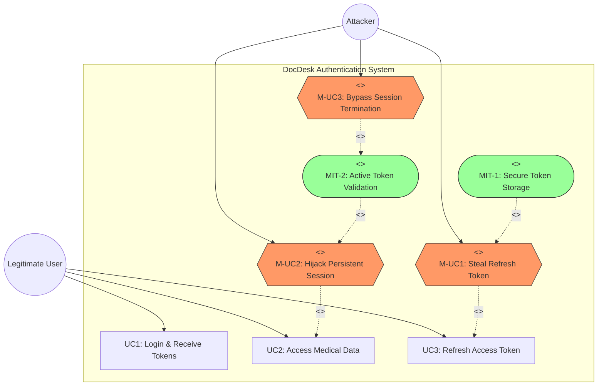

# DocDesk: Security Vulnerability Assessment

## Risk 3: Insecure Token & Session Management

**Member Name**: [User Name]
**Index Number**: [Index Number]
**Assignment**: IS4660 - Mini Project (Continuous Assessment)
**Task**: Risk 3 Identification, Analysis, and Mitigation

---

### 1. Introduction

Insecure Token and Session Management occurs when an application fails to properly protect session identifiers or tokens, allowing attackers to hijack active sessions or maintain unauthorized access. In the DocDesk platform, tokens (JWT) are used for authentication and authorization. This report identifies critical flaws in how these tokens are generated, stored, and verified.

### 2. Risk Identification

During the source code audit of the DocDesk backend, several critical vulnerabilities were identified in the authentication and token management logic.

#### 2.1 Failure to Store Refresh Tokens (Database Sync Logic Error)

In `Docdesk-backend/utils/TokenGenarate/generateRefreshToken.js`, the code intended to save the `refreshToken` to the database contains a syntax error in the Mongoose `findOneAndUpdate` call.

**Vulnerable Code Snippet:**

```javascript
// generateRefreshToken.js - Lines 16-21
updatedUser = await Doctor.findOneAndUpdate(
  { _id: payload._id }, 
  { doctorId: payload._id},
  { refreshToken: refreshToken }, // This is being treated as 'options' instead of 'update'
  { new: true }
);
```

**Technical Explanation:**
Mongoose's `findOneAndUpdate` accepts `(filter, update, options)`. In the current implementation, four arguments are passed. The third argument `{ refreshToken: refreshToken }` is improperly being treated as the `options` object, and the update is only applying `{ doctorId: payload._id}`. Consequently, **Refresh Tokens are never saved to the database**.

#### 2.2 Lack of Token Revocation/Blacklisting

Because the tokens are not saved in the database, the system has no mechanism to revoke a session.

**Vulnerable Code Snippet:**

```javascript
// refreshAccessGenerate.js - Lines 9-11
const refreshAccessToken = async (refreshToken) => {
  try {
    const decoded = jwt.verify(refreshToken, process.env.REFRESH_TOKEN_SECRET);
    // ... verification logic only checks if user exists, not if token is valid/active
```

**Technical Explanation:**
The `refreshAccessToken` function only verifies the JWT signature and expiration. It does not check if the provided token matches a stored "active" token. This means if a token is stolen, an attacker can continue to generate new Access Tokens even if the user logs out or changes their password, as long as the Refresh Token has not expired (7 days).

---

### 4. Impact Analysis

The impact of these vulnerabilities is **High**:

1. **Session Hijacking**: Attackers who capture a Refresh Token can maintain persistent access to patient records for up to 7 days without any way for the administrator or user to terminate the session.
2. **Lack of Control**: The system cannot implement features like "Logout from all devices" because it doesn't track active sessions.
3. **Persistence after Password Reset**: Even if a user changes their password, an existing Refresh Token remains valid because it is never checked against a server-side state.

---

### 5. Mitigation Strategies

To resolve these vulnerabilities, the following measures must be implemented:

#### 4.1 Fix Mongoose Logic

Correct the `findOneAndUpdate` call to ensure the refresh token is stored in the user's document.

**Corrected Code:**

```javascript
updatedUser = await Doctor.findOneAndUpdate(
  { _id: payload._id }, 
  { $set: { refreshToken: refreshToken } }, // Explicitly set the token
  { new: true }
);
```

#### 4.2 Implement Token Validation

Update `refreshAccessToken` to verify that the provided token actually exists in the database.

**Proposed Logic:**

```javascript
const user = await DoctorModel.findOne({ _id: decoded._id });
if (!user || user.refreshToken !== refreshToken) {
    throw new Error("Invalid or Revoked Refresh Token");
}
```

#### 4.3 Secure Storage (Frontend)

Ensure that tokens are stored in **HttpOnly** cookies instead of `localStorage` to prevent Cross-Site Scripting (XSS) attacks from stealing the tokens.

---

### 5. Mis-Use Case Diagram (UML)
The following diagram illustrates the interaction between legitimate users and attackers in the context of the identified vulnerabilities. (Note: Using Flowchart syntax for maximum compatibility).



### 6. Proof of Concept / Practical Implementation
See the attached `Docdesk-backend/utils/TokenGenarate/generateRefreshToken.js` for the primary point of failure. The correction for the logic has been documented in the Mitigation section above.

---

**Report Generated by Antigravity AI**
